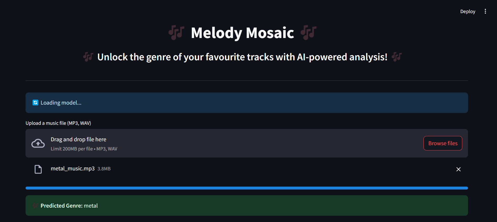

# 🎶 Melody Mosaic

Melody Mosaic is a music genre classification project that combines machine learning with audio signal processing. Using the GTZAN Dataset, deep learning models are trained to classify songs into genres based on their audio features. The project also includes a Streamlit app where users can upload audio files and get genre predictions.

## 📂 Dataset: GTZAN
The GTZAN Dataset contains 1000 audio tracks, each 30 seconds long, spanning 10 music genres:
* Blues
* Classical
* Country
* Disco
* Hip-hop
* Jazz
* Metal
* Pop
* Reggae
* Rock

## 💻 Environment: Google Colab + Streamlit 
* Data preprocessing, feature extraction, model training, and testing all done inside Google Colab.

## 📦 Libraries & Versions Used

| Library/Framework | Version |
|------------------|---------|
| TensorFlow       | 2.18.0  |
| Numpy            | 1.26.4  |
| Matplotlib       | 3.10.0  |
| Librosa          | 0.10.2.post1 |
| Streamlit        | 1.32.0  |


## ⚙️ Colab Setup (Training + Streamlit)
At the start of the Colab notebook, install all packages:

!pip install tensorflow==2.18.0  
!pip install numpy==1.26.4  
!pip install matplotlib==3.10.0  
!pip install librosa==0.10.2.post1  
!pip install streamlit==1.32.0  
!pip install scikit-learn==1.4.1.post1  

## 🧰 Project Workflow
1. Data Preprocessing
   * Load audio files from GTZAN dataset.
   * Extract features using Librosa.
2. Model Development
   * CNN Model using TensorFlow.
   * Optimizer: Adam
3. Training & Evaluation
   * Train on train/validation split.
   * Plot training loss/accuracy using Matplotlib.
   * Evaluate with confusion matrix and classification report.
4. Streamlit App in Colab
   * Upload audio file via Streamlit App running in Colab.
   * Extract features using Librosa.
   * Predict genre using trained model.
   * Display prediction
  
## 📂 Folder Structure
```
MelodyMosaic/
├── GTZAN/                     # Dataset folder (optional if downloaded directly in Colab)
├── melody_mosaic.ipynb        # Main Google Colab notebook (training + Streamlit app setup)
├── app.py                      # Streamlit app script
├── assets/                     # Plots, images, or screenshots (optional)
├── Trained_model.keras         # Saved trained model
├── Training_history            # Training logs, plots, metrics
├── README.md                   # Project documentation (this file)
```

## Explanation for Setting Path to a Single Audio File (User Configurable)
To experiment with a single audio file (for testing feature extraction, visualization, etc.), you can manually set the data_path to point to the folder containing your audio files. Then, specify the file name you want to test.
For example:
#### Set this path to the folder where your audio files are stored
data_path = '/path/to/your/GTZAN/genre_folder'

#### Example: Testing with the first file from the 'blues' genre
selected_file = os.path.join(data_path, 'blues.00000.wav')   
✅ You can modify the data_path and selected_file to test files from any genre (e.g., 'classical', 'rock', etc.) based on how your dataset is organized.

#### Explanation for Full Dataset Path (data_dir)
To load and preprocess the entire GTZAN dataset, set data_dir to the folder containing all genre subfolders.    
data_dir = '/path/to/your/GTZAN/genres_original'

## 📊 Results  
| **Metric**             | **Value** |
|------------------------|------------|
| **Training Accuracy**   | 99.19%     |
| **Training Loss**       | 0.0283     |
| **Validation Accuracy** | 92.32%     |
| **Validation Loss**     | 0.3273     |


